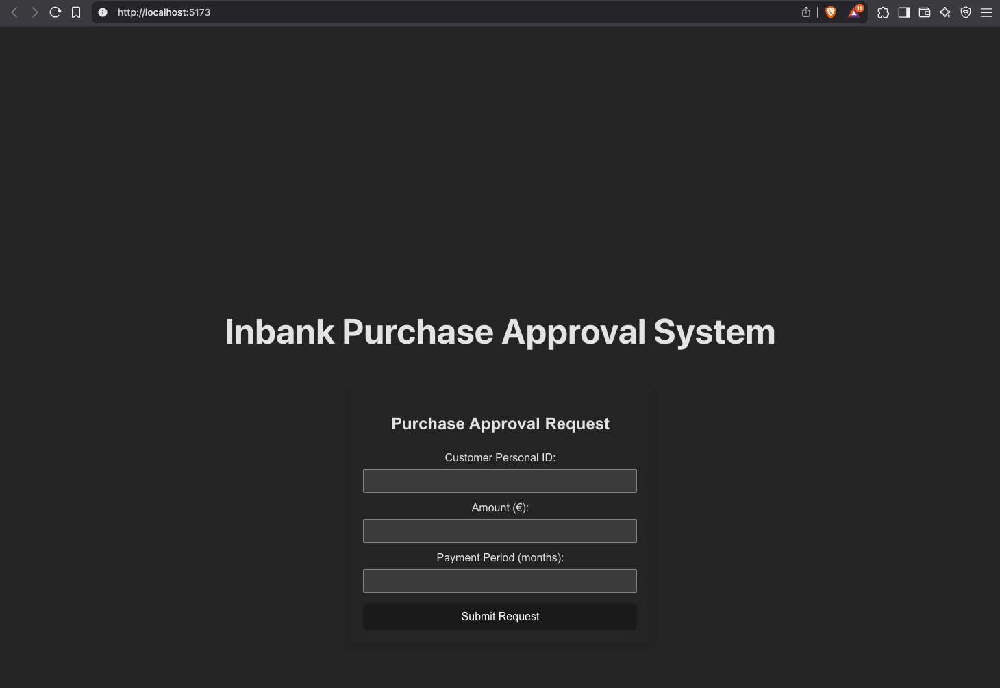

# Inbank Purchase Approval System API
A purchase approval system for online stores

## Required setup (at the time of development)
JDK 23+
 
Gradle 8.13+

Docker 4.39.0+

PostgreSQL 17.4 (postgres:latest in /docker/postgres.yml)

## Required ENV variables:

`POSTGRES_DB=inbank`

`POSTGRES_DEFAULT_SCHEMA=public`

`POSTGRES_USERNAME=<your_db_username>`

`POSTGRES_PASSWORD=<your_db_password>`

# To run applications locally

## BE

### 1. Set and export ENV variables (Linux/MacOS)
* `export $(xargs < .env)`

### 2. Start up DB container
* `docker compose -f purchase-approval-system-be/docker/posgres.yml up -d`

### 3. To run the project with Gradle for `MacOS/Linux`:
Build the project
* `./gradlew clean build` 

Run tests:
* `./gradlew test`

Run integration tests:
* `./gradlew integrationTest`

### 4. And then...
Run the project:
* `./gradlew bootRun`

# Gradle lockfile
To create new lockfile
* `./gradlew dependencies --write-locks`

# Liquibase

To create a new changeset run createChangeDir with the next command:
* `./gradlew createChangeDir -Pid=test` (NB! Replace id with your own id)

# API docs
* For Inbank Purchase Approval System API docs go to `http://localhost:8080/swagger-ui/index.html`

## FE

### 6. Open new terminal window

### 7. Set and export ENV variables one more time (Linux/MacOS)
* `export $(xargs < .env)`

### 8. Install FE dependencies
* `npm i --prefix purchase-approval-system-fe`

### 9. Run FE application
* `npm run dev --prefix purchase-approval-system-fe`

### 10. Go to host displayed by VITE (Usually http://localhost:5173/)

